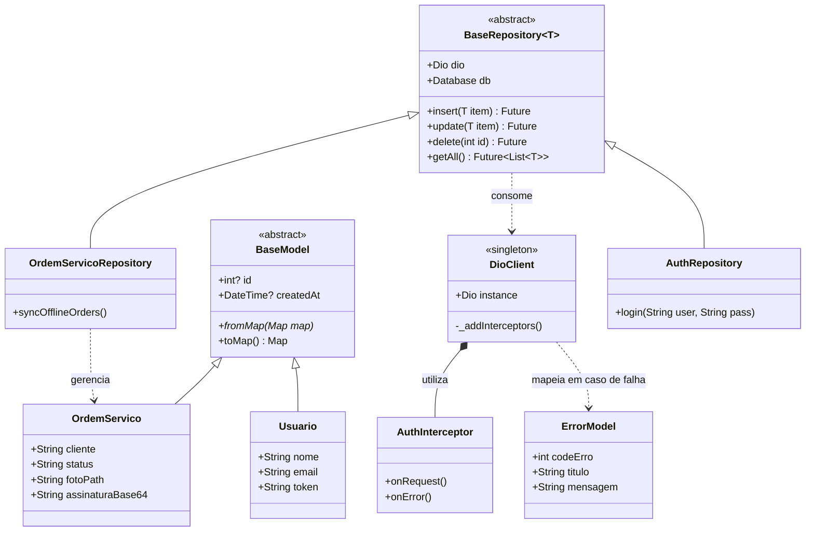

# 🚀 Projeto ServiceFlow - Gestão Inteligente de O.S.

## 📋 Visão Geral
O **ServiceFlow** é um sistema de gestão de ordens de serviço (O.S.) desenvolvido como parte da disciplina de Desenvolvimento de Sistemas para Dispositivos Móveis. O projeto foca em mobilidade, operação *offline-first* e arquitetura modular de alta performance, simulando um ambiente real de desenvolvimento corporativo.

## 🎯 Objetivo
Padronizar o desenvolvimento de um app profissional utilizando **Flutter 3.41.4** e **Dart 3.11.1**, aplicando conceitos de arquitetura limpa, generics e injeção de dependência para eliminar o retrabalho e garantir a escalabilidade do código rumo à avaliação N2.

## 🏗️ Arquitetura do Sistema
Utilizamos a estrutura **Base-Driven Architecture**, focada em componentes genéricos e reutilizáveis, garantindo que a inteligência esteja no `core`:

* **BaseModel:** Classe abstrata que obriga todas as entidades a possuírem `id`, `createdAt` e métodos de conversão (`toMap` / `toJson`).
* **BaseRepository<T>:** Abstração genérica para operações CRUD, centralizando a lógica de acesso a dados (SQLite e API).
* **BaseViewModel<T>:** Gestão de estados (extends `ChangeNotifier`) com suporte nativo a estados de carregamento e erros.
* **DioClient & Interceptors:** Motor de rede centralizado com `Interceptors` para injeção automática de Token JWT e tratamento de erros globais (Ex: 401 Unauthorized).

---

## 📑 Requisitos Funcionais (RF)
* **RF01 - Autenticação:** Login com persistência de token seguro via `flutter_secure_storage` e gestão automatizada via Interceptor.
* **RF02 - Sincronização:** Operação *offline-first* com persistência local em SQLite e fila de sincronismo inteligente.
* **RF03 - Evidências:** Captura de fotos e assinatura digital via dispositivos de hardware.
* **RF04 - Comunicação:** Integração direta com suporte via WhatsApp para chamados emergenciais.
* **RF05 - Componentização:** Uso de widgets customizados e reutilizáveis para padronização da UI.

## 📝 User Stories & Backlog
1.  **US01:** "Como técnico, quero uma interface padronizada para registro ágil de O.S."
2.  **US02:** "Como técnico, preciso salvar meus relatórios mesmo sem conexão com a internet."
3.  **US03:** "Como gestor, quero receber as fotos e assinaturas assim que o dispositivo recuperar a rede."

---

## 📐 Documentação Técnica

### 1. Estrutura de Pastas (Padrão Obrigatório)
```text
lib/
├── app/
│   ├── core/             # Framework base (Model, Repository, Http, Storage)
│   │   ├── models/        # BaseModel
│   │   ├── services/      # DioClient, DatabaseHelper, OfflineSync
│   │   ├── repositories/  # BaseRepository<T>
│   │   ├── mixins/        # UiFeedbackMixin, ValidatorMixin
│   │   └── theme/         # Design System (Colors, Fonts, Themes)
│   ├── shared/           # Widgets Reutilizáveis (CustomTextField, CustomButton)
│   └── modules/          # Funcionalidades (Feature-first)
│       ├── auth/         # Login e AuthRepository
│       ├── dashboard/    # Resumo e Cards de Navegação
│       └── service_order/# OrdemServico, View, Controller e Repository
└── main.dart             # Inicialização e Injeção de Dependências
```

## 📊 Dicionário de Dados (Persistência SQLite)

| Campo | Tipo | Restrição | Descrição |
| :--- | :--- | :--- | :-- |
| id | INTEGER | PK | Chave Primária Autoincrement |
| cliente | TEXT | NOT NULL | Nome do cliente ou empresa atendida |
| status | TEXT | DEFAULT 'P' | "(P)endente, (S)incronizado" |
| foto_path | TEXT | NULLABLE | Caminho físico da imagem no storage local |
| assinatura | TEXT | NULLABLE | String em Base64 da assinatura coletada |
| created_at | TEXT | NOT NULL | Data de criação (ISO8601) |

## 🚀 Padrões de Implementação (O "Jeito ServiceFlow")
Para manter a integridade e o nível profissional do projeto, os alunos devem seguir estas diretrizes:

Regra da Herança:
* **Toda nova entidade de negócio DEVE herdar de BaseModel.
* **Todo novo repositório DEVE herdar de BaseRepository<T>.
* **Toda lógica de estado deve estar em um Controller que utilize notifyListeners().
* **Tratamento de Erros e Feedback:
* **Proibido o uso de print() para depuração em produção.
* **Utilizar obrigatoriamente o UiFeedbackMixin para exibir mensagens de erro/sucesso (SnackBars) padronizadas.

Gestão de Dependências:
A View nunca deve instanciar um Repository. Utilize injeção de dependência via construtor ou Service Locator.

Passagem de Objetos:
Ao navegar da listagem para o detalhe, o objeto completo da Entidade deve ser passado via parâmetro de rota.

Offline-First:
O salvamento inicial deve ser sempre local. A sincronização com a API é uma tarefa de segundo plano (Background Task) ou disparada por monitoramento de conexão.

## 🛠️ Especificação da API (OpenAPI 3.0)
Documentação do contrato que o backend deve fornecer para integração plena:

Estrutura de Resposta de Erro (Padronizada)
Em caso de falha (Status 3XX, 4XX ou 5XX), o backend retornará obrigatoriamente:

```text
	{
	  "codeErro": 401,
	  "titulo": "Acesso Negado",
	  "mensagem": "Sua sessão expirou. Por favor, faça login novamente."
	}
```

*Endpoints*
```text
openapi: 3.0.0
info:
  title: ServiceFlow API
  version: 1.0.0
  description: Endpoints para gestão de ordens de serviço e autenticação técnica.

paths:
  /auth/login:
    post:
      summary: Autentica o técnico e retorna o Token JWT.
      responses:
        '200':
          description: Sucesso. Retorna { "token": "string", "user": { ... } }
  
  /service-orders:
    get:
      summary: Lista todas as ordens vinculadas ao técnico autenticado.
      security:
        - bearerAuth: []
    post:
      summary: Sincroniza uma ordem de serviço criada offline.
      security:
        - bearerAuth: []
      requestBody:
        content:
          application/json:
            schema:
              properties:
                cliente: { type: string }
                foto_base64: { type: string }
                assinatura_base64: { type: string }
                created_at: { type: string }

components:
  securitySchemes:
    bearerAuth:
      type: http
      scheme: bearer
      bearerFormat: JWT
```	  
