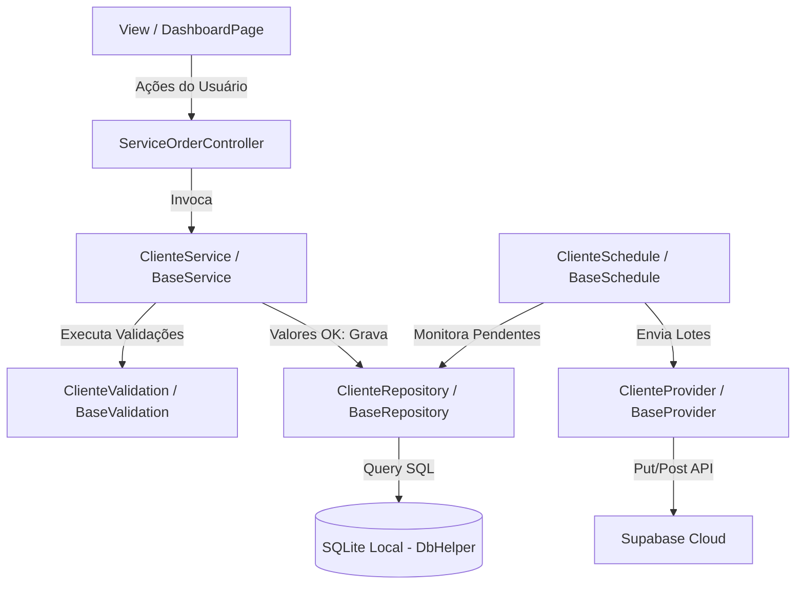

# 🪐 WIKIPEDIA NEXUSFLOW - Guia Supremo do Projeto

> **Bem-vindo à Wikipedia Oficial do NexusFlow!**
> Este documento foi projetado especificamente para que **todos os integrantes do grupo** dominem a arquitetura, o design, a engenharia de dados e o fluxo do sistema. Ele servirá como sua base de conhecimento suprema e roteiro para a apresentação do dia **21/05/2026**.

---

## 📌 Sumário Executivo (Outline)
Clique em qualquer seção para ir direto ao tema:

1. [💡 Visão de Negócio & O Problema](#-1-visão-de-negócio--o-problema) — *O que é o NexusFlow e por que ele existe.*
2. [🎨 Design System & Estética Liquid Glass](#-2-design-system--estética-liquid-glass) — *A identidade visual premium que impressiona a banca.*
3. [🏗️ Arquitetura Técnica: Metodologia ServiceFlow](#-3-arquitetura-técnica-metodologia-serviceflow) — *O esqueleto do app explicado de forma simples.*
4. [💎 A Gema do Projeto: Faturamento Unificado de O.S.](#-4-a-gema-do-projeto-faturamento-unificado-de-os) — *O fluxo dinâmico de CPF e criação atômica.*
5. [🔄 Sincronização Inteligente & Resiliência Offline](#-5-sincronização-inteligente--resiliência-offline) — *Como funcionam os cron schedules e o banco local SQLite.*
6. [📋 Sistema de Logs e Diagnósticos](#-6-sistema-de-logs-e-diagnósticos) — *Auditoria offline robusta sem prints sujos.*
7. [🧪 Cobertura de Testes Automatizados (21 Testes)](#-7-cobertura-de-testes-automatizados-21-testes) — *Como provamos que o sistema é indestrutível.*
8. [🎤 Roteiro de Apresentação (Script Passo a Passo)](#-8-roteiro-de-apresentação-script-passo-a-passo) — *O que cada integrante deve falar e demonstrar no dia 21/05.*
9. [🛠️ Guia de Configuração, Execução e Debug](#-9-guia-de-configuração-execução-e-debug) — *Como rodar o app, testes e ver logs localmente.*
10. [🗄️ Mapeamento de Banco de Dados (Schemas SQLite)](#-10-mapeamento-de-banco-de-dados-schemas-sqlite) — *A modelagem das tabelas do banco de dados local.*

---

## 💡 1. Visão de Negócio & O Problema

### O Problema do Mercado (Dor)
Em sistemas de gestão técnica tradicionais, os técnicos em campo enfrentam duas grandes barreiras:
1. **Instabilidade de Rede**: Sistemas 100% online travam em subsolos, galpões industriais ou áreas rurais, impossibilitando a abertura de ordens de serviço.
2. **Atrito Operacional (UX Ruim)**: Se o cliente não estiver pré-cadastrado no sistema, o técnico é obrigado a cancelar o rascunho do chamado, navegar até a tela de clientes, preencher um formulário longo, salvar, retornar à tela de O.S. e começar tudo de novo.

### A Solução NexusFlow
O NexusFlow resolve essa dor com maestria corporativa:
* **Offline-First Absoluto**: O banco de dados local (SQLite) é a única verdade primária. O aplicativo funciona 100% sem conexão com a internet.
* **Faturamento Atômico Unificado (Abertura Express)**: Cadastro de cliente e emissão de serviço em um único passo na mesma tela, com inteligência de autocompletar via CPF.
* **Sincronização Invisível**: Os dados sobem para a nuvem (Supabase) automaticamente em background à medida que o sinal de internet retorna.

---

## 🎨 2. Design System & Estética Liquid Glass

Para impressionar a banca à primeira vista, o NexusFlow implementa o tema de design mais moderno do mercado móvel: **Liquid Glass (Vidro Fluido)**.

```
┌─────────────────────────────────────────┐
│          Background Fluido              │
│  [Gradiente Orgânico Azul e Violeta]    │
│                                         │
│     ┌─────────────────────────────┐     │
│     │      Glass Container        │     │
│     │  • Vidro Translúcido        │     │
│     │  • Borda Neon Ultrafina     │     │
│     │  • Efeito Blur de Fundo     │     │
│     └─────────────────────────────┘     │
└─────────────────────────────────────────┘
```

### Elementos Chave do Visual
* **Fundo Animado (`LiquidBackground`)**: Um gradiente orgânico com movimentação suave que elimina a sensação de "aplicativo estático".
* **Acrílico Translúcido (`GlassContainer`)**: Painéis com desfoque de fundo (`BackdropFilter` de blur) e opacidade controlada, dando profundidade ao layout.
* **Bordas Neon Ultrafinas**: Bordas de `0.8px` com gradientes brilhantes que delimitam os cards com sofisticação.
* **Contraste de Input Otimizado**: Campos de texto com fundo sutilmente escurecido e bordas ativas em Cyber Cyan, oferecendo legibilidade perfeita sem agredir os olhos (evitando o "efeito bloco branco").
* **Paleta de Cores HHSL (High-Harmonized)**:
  * **Indigo/Neon Violet (`#6366F1`)**: Utilizado para branding e marcações neutras.
  * **Cyber Cyan (`#00E5FF`)**: Foco primário em ações de alto impacto (ex: Faturar, Salvar).
  * **Emerald/Neon Green (`#34D399`)**: Sucesso e validações positivas (ex: Cliente Identificado).
  * **Amber/Gold (`#FBBF24`)**: Alertas e autenticação segura.

---

## 🏗️ 3. Arquitetura Técnica: Metodologia ServiceFlow

Explicar a arquitetura é fácil se você entender o fluxo sequencial de responsabilidades. O NexusFlow divide seu ecossistema em **Camadas Base Genéricas**:



### 📋 Guia Rápido das Camadas (Para responder a Banca!)

* **`BaseModel`**: Contém os atributos globais de controle do app (`id`, `isSync`, `createdAt`). Toda classe de dados (ex: `Cliente`, `ServiceOrder`) estende essa base.
* **`BaseRepository`**: O gerente de persistência local. Contém as queries CRUD prontas em SQLite. Ninguém acessa o banco de dados diretamente; as classes herdam essa funcionalidade de forma limpa.
* **`BaseValidation`**: O auditor fiscal de dados. Valida se os campos obrigatórios estão preenchidos e se as regras de unicidade estão em conformidade antes de salvar.
* **`BaseService`**: O orquestrador. Ele recebe a entidade da View, aciona o validador e, se tudo estiver correto, aciona o repositório para salvar no banco SQLite.
* **`BaseController`**: O controlador da tela. Ele estende `StatelessWidget` e traz embutidos os mixins centrais:
  * `LoaderMixin`: Controla os popups de carregamento (`showLoading`).
  * `MessagesMixin`: Exibe barras de mensagens (`showSuccess` com auto-dismiss de 3s, `showError` persistente com fechar manual, `showWarning`).
  * **`executeCrudOperation`**: Método genérico que faz tudo sozinho! Exibe loading, executa a query assíncrona, esconde loading, exibe caixa de sucesso se tudo der certo, ou trata erros amigavelmente se falhar.

---

## 💎 4. A Gema do Projeto: Faturamento Unificado de O.S.

Esta é a funcionalidade central que vai garantir a nota máxima do grupo. Ela demonstra a aplicação prática de UX aliada a engenharia de banco de dados local.

### O Fluxo Passo a Passo na Apresentação

```
[ Usuário digita CPF na Tela ]
              │
              ▼
    ( CPF tem 11 dígitos? ) ─── NÃO ───► [ Permanece no preenchimento manual ]
              │ SIM
              ▼
   [ Dispara busca em background no SQLite ]
              │
      ( Encontrou Registro? )
       /                  \
     SIM                  NÃO
     /                      \
[ Autocompleta Dados ]    [ Limpa campos para cadastro ]
[ Badge VERDE Exibido ]   [ Permite entrada manual ]
[ "Cliente Identificado" ]
```

1. **Gatilho Dinâmico (CPF/CNPJ)**:
   * O técnico digita o CPF no campo. O controlador ouve a mudança e, assim que o texto alcança 11 dígitos, inicia a busca.
2. **Auto-Busca & Autocompletar**:
   * O sistema aciona o `ClienteService.findByDocumento(...)`.
   * Se cadastrado: Os dados de Nome, E-mail, Telefone e Endereço são preenchidos **automaticamente**. Um badge verde luminoso neon `"CLIENTE IDENTIFICADO"` é renderizado para dar segurança ao operador. Os campos continuam editáveis (permitindo atualizar telefone ou endereço na hora).
   * Se Novo: Os campos permanecem abertos para digitação normal.
3. **Escrita Atômica (Faturamento Express)**:
   * Ao clicar em "Faturar O.S.", o sistema valida tudo.
   * Se for cliente novo, ele invoca primeiro o `ClienteService.create(...)`, inserindo o cliente na tabela `clientes` e obtendo o ID auto-incrementado gerado pelo SQLite.
   * Em seguida, insere a ordem de serviço na tabela `ordens_servico` vinculando a chave estrangeira `cliente_id` com o ID gerado.
   * Tudo acontece offline, em milissegundos, sem travar a interface!

---

## 🔄 5. Sincronização Inteligente & Resiliência Offline

O segredo de um excelente sistema corporativo offline-first está no desacoplamento da sincronização em background.

### As Engrenagens do Sync
* **`ScheduleManager`**: O maestro. Ele inicializa os timers ao abrir o aplicativo.
* **`BaseSchedule`**: O temporizador individual por módulo (ex: `ClienteSchedule`, `ServiceOrderSchedule`). A cada 5 minutos (ou quando forçado manualmente), ele aciona a sincronização.
* **`BaseProvider`**: O transmissor. Ele traduz a entidade SQLite para o formato REST externo (Supabase Postgrest) e faz a chamada HTTP usando o `AppClient`.

### Resolução de Conflitos (Ponto Crítico de Questionamento da Banca!)
> **Pergunta provável da banca:** *"E se o registro local for alterado na nuvem simultaneamente por outro técnico?"*
> **Resposta do Grupo:** "Implementamos um resolveConflict que adota o modelo remoto como verdade absoluta ao mesmo tempo em que preserva o ID de referência local do SQLite, garantindo que chaves estrangeiras locais não quebrem e evitando duplicações!"

---

## 📋 6. Sistema de Logs e Diagnósticos

O aplicativo possui um sistema de auditoria interno profissional para diagnosticar problemas e monitorar a sincronização.

* **LogService (Singleton)**: Evita o uso de `print` ou `debugPrint` poluídos que pesam a memória em produção.
* **Gravação Local**: Todos os logs estruturados (`info`, `warning`, `error`, `debug`) são persistidos localmente em uma tabela própria do SQLite (`system_logs`) via `LogRepository`.
* **Metadados Completos**: Cada log armazena a origem (classe), a operação (método), a mensagem exata do erro ou sucesso e o timestamp exato do evento, facilitando a rastreabilidade em produção.

---

## 🧪 7. Cobertura de Testes Automatizados (21 Testes)

Nós provamos a qualidade do nosso código através de **21 testes verdes**. Se a banca questionar a segurança do sistema contra quebras acidentais, mencione nossa robusta suite de testes:

```
                  ┌───────────────┐
                  │ E2E/Integração│  ◄── Habilitado via integration_test
                  └───────────────┘
                 ┌─────────────────┐
                 │ Testes de Widget│  ◄── Valida a construção da UI e inputs
                 └─────────────────┘
                ┌───────────────────┐
                │ Testes Unitários  │  ◄── Testa a lógica de negócio pura
                └───────────────────┘
```

### O que os Testes Validam Exatamente:
* **Autenticação**: Cenários de login com credenciais válidas e inválidas, garantindo a navegação segura.
* **Dashboard**: Carga de KPI em tempo de execução e cálculos automáticos de faturamento.
* **Validações de Clientes**: Teste estrito de regras de negócio de CPF/CNPJ válidos, e-mails obrigatórios e tamanho de telefone.
* **Controlador de Faturamento**: Testa a persistência atômica da O.S., criação de loading visual e tratamento de erro de integridade de chaves primárias.
* **Camada de Aplicação (`ClienteService`)**: Fluxos complexos de escrita, validações automatizadas de banco e a exclusão lógica segura (**Soft Delete** local).
* **Sincronização**: Conversão correta do modelo interno SQLite para payloads externos da nuvem e injeção transparente via GetIt.

---

## 🎤 8. Roteiro de Apresentação (Script Passo a Passo)

Use este roteiro para ensaiar com o grupo. Ele está estruturado para durar de **10 a 15 minutos**, dividindo as falas de forma justa e destacando os melhores pontos!

### 👤 Integrante 1: Introdução e Contexto (Duração: 2-3 min)
* **O que falar:**
  * Apresentar o nome do projeto (**NexusFlow**) e os integrantes do grupo.
  * Explicar o problema da falta de internet para técnicos de campo e o atrito de cadastros separados.
  * Introduzir a tese do projeto: "Desenvolvemos um aplicativo móvel corporativo focado em faturamento express offline-first usando arquitetura limpa em Flutter/Dart".
* **O que mostrar em tela:**
  * O aplicativo aberto na tela de Login premium e moderna.

### 👤 Integrante 2: A Experiência Visual e o Conceito Liquid Glass (Duração: 2-3 min)
* **O que falar:**
  * Mostrar a tela de login e realizar a autenticação.
  * Destacar a estética **Liquid Glass**: o gradiente animado fluido de fundo (`LiquidBackground`), o uso de painéis translúcidos com blur de fundo (`GlassContainer`), bordas brilhantes ultrafinas de `0.8px` e caixas de texto com contraste adequado que evitam cansaço visual.
  * Mostrar a transição reativa do login para a Home (Dashboard) com visualização dos KPIs e O.S. Recentes.
* **O que mostrar em tela:**
  * Realizar o login ao vivo, navegar pelas abas (Painel, Clientes, Nova OS, Equipe).

### 👤 Integrante 3: A Estrela da Apresentação — Nova OS Express (Duração: 3-4 min)
* **O que falar:**
  * Demonstrar o faturamento dinâmico com auto-busca via CPF.
  * **Cenário A (Cliente existente)**: Digite um CPF já cadastrado no SQLite. Mostre os campos preenchendo-se sozinhos instantaneamente e destaque o badge verde brilhante `"CLIENTE IDENTIFICADO"`.
  * **Cenário B (Cliente novo)**: Digite um CPF não cadastrado. Mostre que os campos ficam limpos e que o sistema permite o preenchimento manual completo.
  * Realize a gravação. Destaque que o sistema salvou **ambos** de forma atômica no SQLite local em milissegundos sem qualquer lentidão.
* **O que mostrar em tela:**
  * Digitação de CPF cadastrado (completando os dados).
  * Digitação de CPF novo, preenchimento rápido e clique em "Faturar O.S.". Mostrar a notificação de sucesso premium subindo em tela.

### 👤 Integrante 4: Engenharia de Sincronização, Logs e Qualidade (Duração: 3-4 min)
* **O que falar:**
  * Explicar como os dados são mantidos offline de forma resiliente e que o `ScheduleManager` monitora em segundo plano quando a internet retorna para subir os lotes para o Supabase.
  * Explicar o sistema de **Soft Delete** (excluir cliente de forma lógica mantendo integridade histórica no banco).
  * Explicar a robustez técnica do projeto mencionando a pirâmide de testes e a nossa suite com **21 testes verdes automáticos** cobrindo todas as áreas vitais.
* **O que mostrar em tela / Concluir:**
  * Mostrar a aba "Equipe" demonstrando a sincronização dos técnicos.
  * Concluir a apresentação reforçando a nota técnica excelente do projeto: arquitetura limpa, interface moderna, banco local de alta resiliência e validação matemática de código via testes automatizados.

---

## 🛠️ 9. Guia de Configuração, Execução e Debug

Esta seção é um utilitário prático para que qualquer integrante do grupo consiga rodar o NexusFlow em sua própria máquina de desenvolvimento sem atritos.

### 📥 1. Inicializando as Dependências
Abra o terminal na raiz do projeto e execute o comando abaixo para baixar todas as dependências do Flutter (incluindo o suporte à testes `integration_test`):
```bash
flutter pub get
```

### ⚙️ 2. Banco de Dados SQLite (Mock Inteligente vs Físico)
* **Em Dispositivos Físicos / Simuladores (Android/iOS)**: O aplicativo utiliza o banco de dados SQLite real via biblioteca local nativa. A criação de tabelas é 100% automática ao inicializar o app pela primeira vez.
* **Em Navegadores Web (Chrome/Web-Server)**: Como navegadores não possuem suporte de driver nativo direto para SQLite C, implementamos um mock em memória inteligente (`WebMockDatabase` em [database_helper.dart](file:///home/lan/nexusflow/lib/app/core/helpers/database_helper.dart)) que simula perfeitamente o comportamento e as colunas padrão (`ativo = 1` por padrão) para testes e apresentações em browser sem quebrar nada!

### 🏃 3. Executando o Aplicativo
Você pode rodar o aplicativo de forma direcionada para o Chrome (excelente para apresentação em datashow):
```bash
flutter run -d chrome
```
Ou no servidor web local na porta de sua escolha:
```bash
flutter run -d web-server --web-port 8080
```

### 🧪 4. Executando a Suite de Testes
Para provar que nenhuma alteração quebrou a integridade das regras de negócio antes ou durante a apresentação, execute todos os 21 testes integrados via linha de comando:
```bash
flutter test
```

### 🔍 5. Como visualizar Logs e Debug no Console
O sistema possui o `LogService` centralizado. Caso precise demonstrar o funcionamento dos logs ao vivo ou verificar erros no console, todos os eventos relevantes do app são impressos no terminal com tags coloridas estruturadas:
* `[INFO]` - Mensagens informativas de rotinas comuns de tela.
* `[WARNING]` - Avisos de atenção (ex: CPF não localizado).
* `[ERROR]` - Falhas de sistema capturadas com stack trace completo para auditoria.

---

## 🗄️ 10. Mapeamento de Banco de Dados (Schemas SQLite)

Para fins de modelagem de dados da disciplina, o banco de dados do NexusFlow possui as tabelas a seguir mapeadas fisicamente no SQLite local:

### 1. Tabela `usuarios`
Armazena a equipe técnica e suas credenciais/configurações.
| Coluna | Tipo | Restrições / Padrão | Descrição |
| --- | --- | --- | --- |
| `id` | `INTEGER` | `PRIMARY KEY AUTOINCREMENT` | Identificador interno local |
| `supabase_id` | `TEXT` | `NOT NULL UNIQUE` | ID de referência global do Supabase Auth |
| `email` | `TEXT` | `NOT NULL UNIQUE` | E-mail do colaborador |
| `nome_completo` | `TEXT` | `NOT NULL` | Nome completo do usuário técnico |
| `grupo_id` | `TEXT` | `NOT NULL` | ID do grupo para isolamento multitenant |
| `perfil` | `TEXT` | `DEFAULT 'tecnico'` | Nível de permissão (administrador/tecnico) |
| `ativo` | `INTEGER` | `DEFAULT 1` | Indicador de exclusão lógica (Soft Delete) |
| `is_sync` | `INTEGER` | `DEFAULT 0` | Status de sincronização na nuvem (0: Pendente, 1: Sincronizado) |

### 2. Tabela `clientes`
Armazena a carteira de clientes sincronizada em lotes.
| Coluna | Tipo | Restrições / Padrão | Descrição |
| --- | --- | --- | --- |
| `id` | `INTEGER` | `PRIMARY KEY AUTOINCREMENT` | Identificador interno local |
| `nome` | `TEXT` | `NOT NULL` | Nome completo / Razão social do cliente |
| `email` | `TEXT` | `NOT NULL` | E-mail corporativo |
| `telefone` | `TEXT` | `NOT NULL` | Telefone de contato formatado |
| `documento` | `TEXT` | `NULLABLE` | CPF ou CNPJ único do cliente |
| `endereco` | `TEXT` | `NULLABLE` | Endereço do cliente |
| `ativo` | `INTEGER` | `DEFAULT 1` | Indicador de exclusão lógica (Soft Delete) |
| `is_sync` | `INTEGER` | `DEFAULT 0` | Status de sincronização na nuvem (0: Pendente, 1: Sincronizado) |

### 3. Tabela `ordens_servico`
Tabela centralizada de faturamento e registro de manutenções técnicas.
| Coluna | Tipo | Restrições / Padrão | Descrição |
| --- | --- | --- | --- |
| `id` | `INTEGER` | `PRIMARY KEY AUTOINCREMENT` | Identificador interno local da O.S. |
| `cliente_id` | `INTEGER` | `NOT NULL` (FK -> `clientes`) | Vínculo com a chave estrangeira do cliente |
| `tecnico_id` | `INTEGER` | `NOT NULL` (FK -> `tecnicos`) | Vínculo com a chave estrangeira do técnico encarregado |
| `observacao` | `TEXT` | `NULLABLE` | Descrição técnica dos problemas detectados |
| `valor_pecas` | `REAL` | `DEFAULT 0` | Valor em peças aplicadas na O.S. |
| `foto_antes` | `TEXT` | `NULLABLE` | Path local/URL da imagem do equipamento com problema |
| `foto_depois` | `TEXT` | `NULLABLE` | Path local/URL da imagem do equipamento consertado |
| `assinatura` | `TEXT` | `NULLABLE` | Assinatura em Base64 do cliente no faturamento |
| `ativo` | `INTEGER` | `DEFAULT 1` | Indicador de exclusão lógica (Soft Delete) |
| `is_sync` | `INTEGER` | `DEFAULT 0` | Status de sincronização na nuvem (0: Pendente, 1: Sincronizado) |

### 4. Tabela `system_logs`
Mesa de diagnósticos de segurança, alertas e falhas do aplicativo.
| Coluna | Tipo | Restrições / Padrão | Descrição |
| --- | --- | --- | --- |
| `id` | `INTEGER` | `PRIMARY KEY AUTOINCREMENT` | Identificador interno do log |
| `level` | `TEXT` | `NOT NULL` | Gravidade do evento (INFO, WARNING, ERROR) |
| `source` | `TEXT` | `NOT NULL` | Classe de origem do evento no Flutter |
| `operation` | `TEXT` | `NOT NULL` | Método no qual o evento ocorreu |
| `message` | `TEXT` | `NOT NULL` | Descrição clara em pt-BR da ação ocorrida |
| `metadata` | `TEXT` | `NULLABLE` | Payload detalhado em JSON de contexto |
| `timestamp` | `TEXT` | `DEFAULT CURRENT_TIMESTAMP` | Data/hora exata do registro de log local |

---

> [!TIP]
> **Dica de Ouro para a Apresentação:**
> Ensaiem com antecedência a alternância de falas. Se a banca interromper com perguntas técnicas sobre "como funciona o banco", citem o **DbHelper do SQLite como única fonte primária de dados** e a separação limpa das regras de negócios no **ClienteService e ServiceOrderController**. Isso demonstrará maturidade profissional impecável do grupo!
